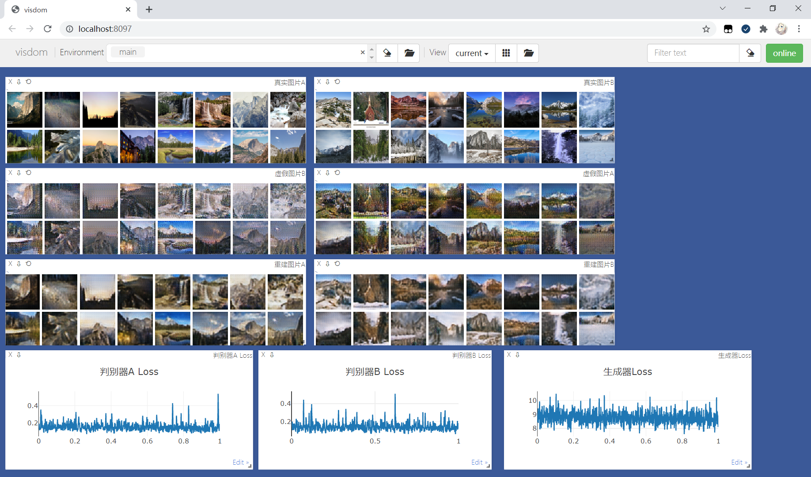

# cyclegan-demo

基于Pytorch构建CycleGAN示例

## 如何运行

### 准备数据集

将数据集整理成4个文件，分别命名为

- trainA, trainB：训练集，A、B代表两类图片
- testA, testB：测试集，A、B代表两类图片

例如

```
D:\CODE\CYCLEGAN-DEMO\DATA\SUMMER2WINTER
├─testA
├─testB
├─trainA
└─trainB
```

之后在`main.py`中将root设为数据集的路径。

### 参数设置

见`main.py`中的初始化参数

```python
# 初始化参数
# seed: 随机种子
# root: 数据集路径
# output_model_root: 模型的输出路径
# image_size: 图片尺寸
# batch_size: 一次喂入的数据量
# lr: 学习率
# betas: 一阶和二阶动量
# epochs: 训练总次数
# historical_epochs: 历史训练次数
# - 0表示不沿用历史模型
# - >0表示对应训练次数的模型
# - -1表示最后一次训练的模型
# save_every: 保存频率
# loss_range: Loss的显示范围
seed = 123
data_root = 'D:/code/cyclegan-demo/data/summer2winter'
output_model_root = 'output/model'
image_size = 64
batch_size = 16
lr = 2e-4
betas = (.5, .999)
epochs = 100
historical_epochs = -1
save_every = 1
loss_range = 1000
```

### 安装和运行

1. 安装依赖

```shell
pip install -r requirements.txt
```

2. 打开命令行，运行Visdom

```shell
python -m visdom.server
```

3. 运行主程序

```shell
python main.py
```

### 训练过程的可视化展示

访问地址[http://localhost:8097](http://localhost:8097)即可进入Visdom可视化页面，页面中将展示：

- A类真实图片 -【A2B生成器】 -> B类虚假图片 -【B2A生成器】 -> A类重构图片
- B类真实图片 -【B2A生成器】 -> A类虚假图片 -【A2B生成器】 -> B类重构图片
- 判别器A、B以及生成器的Loss曲线



一些可视化的具体用法可见Visdom的使用方法。

### 测试

TODO

## 介绍

### 目录结构

- `dataset.py` 数据集
- `discriminator.py` 判别器
- `generater.py` 生成器
- `generater_v2.py` 使用上采样+卷积替换反卷积版本的生成器
- `main.py` 主程序
- `replay_buffer.py` 缓冲区
- `resblk.py` 残差块
- `util.py` 工具方法

### 原理介绍

残差块是生成器的组成部分，其结构如下

```
Resblk(
  (main): Sequential(
    (0): ReflectionPad2d((1, 1, 1, 1))
    (1): Conv2d(3, 3, kernel_size=(3, 3), stride=(1, 1))
    (2): InstanceNorm2d(3, eps=1e-05, momentum=0.1, affine=False, track_running_stats=False)
    (3): ReLU(inplace=True)
    (4): ReflectionPad2d((1, 1, 1, 1))
    (5): Conv2d(3, 3, kernel_size=(3, 3), stride=(1, 1))
    (6): InstanceNorm2d(3, eps=1e-05, momentum=0.1, affine=False, track_running_stats=False)
  )
)
```

生成器结构如下，由于采用全卷积结构，事实上其结构与图片尺寸无关

```
Generater(
  (input): Sequential(
    (0): ReflectionPad2d((3, 3, 3, 3))
    (1): Conv2d(3, 64, kernel_size=(7, 7), stride=(1, 1))
    (2): InstanceNorm2d(64, eps=1e-05, momentum=0.1, affine=False, track_running_stats=False)
    (3): ReLU(inplace=True)
  )
  (downsampling): Sequential(
    (0): Conv2d(64, 128, kernel_size=(3, 3), stride=(2, 2), padding=(1, 1))
    (1): InstanceNorm2d(128, eps=1e-05, momentum=0.1, affine=False, track_running_stats=False)
    (2): ReLU(inplace=True)
    (3): Conv2d(128, 256, kernel_size=(3, 3), stride=(2, 2), padding=(1, 1))
    (4): InstanceNorm2d(256, eps=1e-05, momentum=0.1, affine=False, track_running_stats=False)
    (5): ReLU(inplace=True)
  )
  (resnet): Sequential(
    (0): Resblk
    (1): Resblk
    (2): Resblk
    (3): Resblk
    (4): Resblk
    (5): Resblk
    (6): Resblk
    (7): Resblk
    (8): Resblk
  )

  (upsampling): Sequential(
    (0): ConvTranspose2d(256, 128, kernel_size=(3, 3), stride=(2, 2), padding=(1, 1), output_padding=(1, 1))
    (1): InstanceNorm2d(128, eps=1e-05, momentum=0.1, affine=False, track_running_stats=False)
    (2): ReLU(inplace=True)
    (3): ConvTranspose2d(128, 64, kernel_size=(3, 3), stride=(2, 2), padding=(1, 1), output_padding=(1, 1))
    (4): InstanceNorm2d(64, eps=1e-05, momentum=0.1, affine=False, track_running_stats=False)
    (5): ReLU(inplace=True)
  )
  (output): Sequential(
    (0): ReplicationPad2d((3, 3, 3, 3))
    (1): Conv2d(64, 3, kernel_size=(7, 7), stride=(1, 1))
    (2): Tanh()
  )
)
```

判别器结构如下，池化层具体尺寸由图片尺寸决定，64x64的图片对应池化层为6x6

```
Discriminator(
  (main): Sequential(
    (0): Conv2d(3, 64, kernel_size=(4, 4), stride=(2, 2), padding=(1, 1))
    (1): LeakyReLU(negative_slope=0.2, inplace=True)
    (2): Conv2d(64, 128, kernel_size=(4, 4), stride=(2, 2), padding=(1, 1))
    (3): InstanceNorm2d(128, eps=1e-05, momentum=0.1, affine=False, track_running_stats=False)
    (4): LeakyReLU(negative_slope=0.2, inplace=True)
    (5): Conv2d(128, 256, kernel_size=(4, 4), stride=(2, 2), padding=(1, 1))
    (6): InstanceNorm2d(256, eps=1e-05, momentum=0.1, affine=False, track_running_stats=False)
    (7): LeakyReLU(negative_slope=0.2, inplace=True)
    (8): Conv2d(256, 512, kernel_size=(4, 4), stride=(1, 1), padding=(1, 1))
    (9): InstanceNorm2d(512, eps=1e-05, momentum=0.1, affine=False, track_running_stats=False)
    (10): LeakyReLU(negative_slope=0.2, inplace=True)
    (11): Conv2d(512, 1, kernel_size=(4, 4), stride=(1, 1), padding=(1, 1))
  )
  (output): Sequential(
    (0): AvgPool2d(kernel_size=torch.Size([6, 6]), stride=torch.Size([6, 6]), padding=0)
    (1): Flatten(start_dim=1, end_dim=-1)
  )
)
```

训练共有三个优化器，分别负责生成器、判别器A、判别器B的优化。

损失有三种类型：
- 一致性损失：A(B)类真实图片与经生成器生成的图片的误差，该损失使得生成后的风格与原图更接近，采用L1Loss
- 对抗损失：A(B)类图片经生成器得到B(A)类图片，再经判别器判别的错误率，采用MSELoss
- 循环损失：A(B)类图片经生成器得到B(A)类图片，再经生成器得到A(B)类的重建图片，原图和重建图片的误差，采用L1Loss

生成器的训练过程：

1. 将A(B)类真实图片送入生成器，得到生成的图片，计算生成图片与原图的一致性损失
2. 将A(B)类真实图片送入生成器得到虚假图片，再送入判别器得到判别结果，计算判别结果与真实标签1的对抗损失(虚假图片应能被判别器判别为真实图片，即生成器能骗过判别器)
3. 将A(B)类虚假图片送入生成器，得到重建图片，计算重建图片与原图的循环损失
4. 计算、更新梯度

判别器A的训练过程：

1. 将A类真实图片送入判别器A，得到判别结果，计算判别结果与真实标签1的对抗损失(判别器应将真实图片判别为真实)
2. 将A类虚假图片送入判别器A，得到判别结果，计算判别结果与虚假标签0的对抗损失(判别器应将虚假图片判别为虚假)
3. 计算、更新梯度